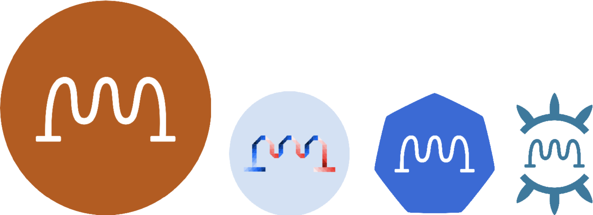

# Request Yo Racks 3.0 Concepts

RYR 3.0 is a **MAJOR** rewrite of the project. And RYR being a collection of projects, changes will happen in most of them.

The reasons for such a rewrite are mainly:

* Leveraging what we learned and apply it to produce higher quality deliverables
* Using technologies with a higher adoption rate in order to:

    * Benefit from a more modern tooling
    * Gain more contributors

Working with [Polymer] was cool, but it was very hard to find people interested in helping. Switching to [ReactJS] gave us the opportunity to attract more contributors very quickly. It also made it way quicker/easier to find documentation, examples and tools.

## Projects

### Frontend

As mentioned previously, we are switching from [Polymer] to [ReactJS]. This is the biggest task!

In addition to this we want our components to be documented and tested. We want to be able to use them individually
easily and provide demos (as a form a test and documentation).

We plan on using [Ant](https://ant.design/) and [Ant Mobile](https://mobile.ant.design/) for the UI component libraries.

List of [Issues](https://github.com/request-yo-racks/web/issues).

### Backend

The backend is currently operational, distributed, elastic and well tested. But we want to go even further.

Here is what we want to implement in the next version:

* Use OpenAPI to define the REST API
    * Describe the API using an OpenAPI document
    * Generate the REST API server

* Add extra collectors
* Improve the validity of the data being collected
* Send emails automatically

List of [Issues](https://github.com/request-yo-racks/api/issues).

### Documentation

Documentation is a key principle of this project. There is always something to write about or some room for improvement.

We have very good overview documentation, a great setup guide, but each of our project should have individual
documentation to help contributors use them.

### Infrastructure

The Infrastructure is in a fairly good shape, but we are always looking for more automation
or ways to improve our workflows.

List of [Issues](https://github.com/request-yo-racks/infra/issues).

### Artwork / Branding

The project needs a stronger identity. 

We have cool logos, a nice design, but we have nothing defining the "brand" of
our project.

## Side projects

### Landing page

The current landing page was a very small and simple project we used to learn [Polymer] 3.0. Converting it to [ReactJS]
would be a good way to become more familiar with the framework.

List of [Issues](https://github.com/request-yo-racks/landing-page/issues).

### Chart repository index page

Our [Helm Chart index page](https://charts.requestyoracks.org) is a very simple static page built by parsing our
[chart repository index file](https://github.com/request-yo-racks/charts/blob/gh-pages/index.yaml)
([official documentation](https://github.com/helm/helm/blob/master/docs/chart_repository.md#the-index-file)).

Ideally we would suppress the static generation step by developing an application which would generate the page on the
fly. Something similar to what [Docsify] does, but for the chart index instead.

### Flower Docker image

There is currently no official upstream [flower] image for Docker. Ours is similar to the
[images that can be found](https://hub.docker.com/search/?isAutomated=0&isOfficial=0&page=1&pullCount=0&q=celery+flower&starCount=0)
on the Docker hub, but has the advantages of being current and very small (47MB - 3x to 6x smaller than other ones).

We should polish it and position it as the default image for Flower, and ideally it would become the official upstream
image.

List of [Issues](https://github.com/request-yo-racks/docker-celery-flower/issues).

### Flower Helm Chart

Having a good Docker Image is one thing, but being able to deploy it easily and quickly is another one.

Our chart works fine to deploy [Flower] in our development environment but is not production ready. We should push it
to the next level and like the Docker image, position it as the official chart, submit it upstream, as well as to the
[official Charts for Helm](https://github.com/helm/charts).

List of [Issues](https://github.com/request-yo-racks/charts/issues).

### Style guide

We need a style guide to ensure consistency in our projects and simplify the development process.

[react-styleguidist](https://react-styleguidist.js.org/) seems to be a great candidate, but there is definitely more
research to do.

## Projects we use that could receive some love

We are using a wide variety of open source tools to build RYR. It would be nice to allocate some cycles to contribute
back.

### Python - [Flower]

### Python - [Responses]

[Docsify]: (https://docsify.js.org)
[Flower]: (https://github.com/mher/flower)
[Polymer]: (https://www.polymer-project.org/3.0/start)
[ReactJS]: (https://reactjs.org)
[Responses]: (https://github.com/getsentry/responses)
